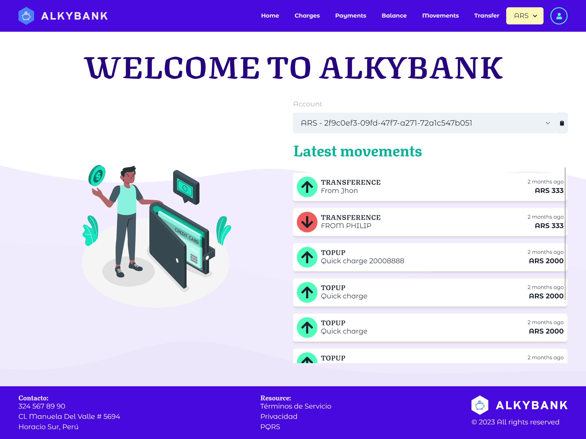

# Alkybank - **[Go to the App](https://alkybank-rho.vercel.app/)**



## Cosas que puse en practica

- Implementacion de un sistema de autenticacion basado en JWT.
- Validacion de entrada y salida de datos.
- Manejo de rutas privadas y publicas.
- Implementacion de notificaciones.
- Implementacion de paginacion.
- Implementacion de un sistema de filtrado y busqueda.
- Testing unitario con Jest y React Testing Library.
- Manejo de errores.

## Tech Stack

- [NextJS](https://nextjs.org/)
- [React Query](https://tanstack.com/query/v4/docs/react/overview)
- [Zod](https://zod.dev/)
- [Chakra ui](https://chakra-ui.com/getting-started)

## Variables de entorno

Para iniciar este proyecto, tendras que añadir las siguientes variables de entorno a tu archivo .env.development.local

```
// Virtual wallet api
NEXT_PUBLIC_API

// Web url
NEXT_PUBLIC_WEB
```

## Como iniciar el proyecto

Clonar el proyecto

```bash
  git clone https://github.com/JPerezC92/AlkyBank.git
```

Ir al directorio del proyecto

```bash
  cd AlkyBank
```

Instalar las dependencias

```bash
  npm install
```

Iniciar la aplicación

```bash
  npm run dev
```

## Galeria


